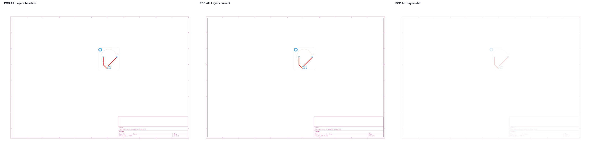
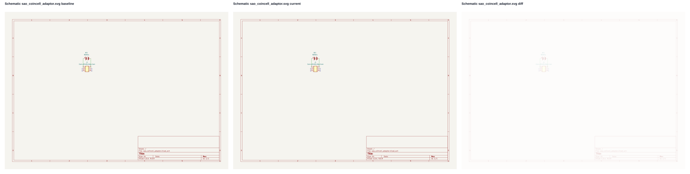

Compared base `a07158937adb` to head `e092195769c1`.

Generated 9 visual diff SVG file(s).
Generated 2 PNG preview file(s) at 3200px wide.

## Diff Files

- `pcb/All_Layers.svg` (86726 bytes)
- `pcb/B_Cu.svg` (61330 bytes)
- `pcb/B_Mask.svg` (59478 bytes)
- `pcb/B_SilkS.svg` (65382 bytes)
- `pcb/Edge_Cuts.svg` (59474 bytes)
- `pcb/F_Cu.svg` (63218 bytes)
- `pcb/F_Mask.svg` (59242 bytes)
- `pcb/F_SilkS.svg` (58150 bytes)
- `schematic/sao_coincell_adaptor.svg` (83846 bytes)

## Embedded Preview

